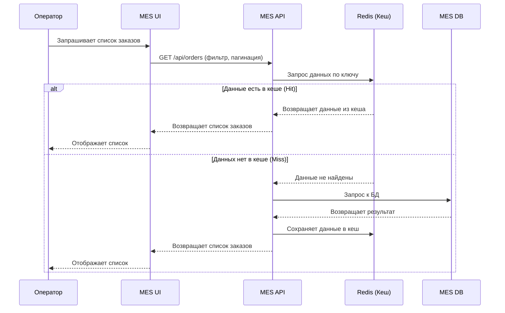

# Архитектурное решение по кешированию

## Мотивация

Операторы MES жалуются на медленную загрузку страницы со списком заказов, даже с пагинацией и фильтрацией.

Проблема в том, что каждый запрос ходит напрямую в MES DB. При этом многие операторы запрашивают одни и те же списки (по статусам, одинаковым фильтрам). Напрашивается кеширование.

Что даст кеширование:

Ускорит появление новых заказов в списке у операторов

Снизит нагрузку на MES DB

Повысит производительность MES UI и UX

Что кешируем:
Списки заказов, которые отдаёт MES API (с учётом статусов и пагинации).

## Предлагаемое решение

### Тип кеширования

Выбрано серверное кеширование (в MES API). 

**Обоснование**: MES UI — внутреннее SPA, работает на разных устройствах. Клиентское кеширование не решает проблему первой загрузки и не снимает нагрузку с MES DB.

### Паттерн кеширования

Выбран паттерн Write-Through.

**Обоснование**: при изменении статуса обновляются и БД, и кеш — в рамках одной транзакции. Даже если потеряется событие из очереди, кеш останется актуальным, а заказы будут выполнены (обновление идёт напрямую из MES API, а не асинхронно).

**Альтернативы (почему не подходят)**:

- Read-Through — требует сложной настройки кеша как прокси

- Refresh-Ahead — избыточен: заказы появляются редко (до +100 в месяц). Если бы поток был постоянным — подошёл бы

- Write-Behind — не нужен: запись списка заказов сводится к обновлению статуса, это редкая операция и не относится к кешируемому списку

### Sequence Diagram

### Инвалидация кеша

Программная инвалидация выбрана, потому что точно известно, когда меняются данные (при изменении статуса заказа) и какие ключи нужно очистить. Это даёт максимальную актуальность при минимальных затратах. TTL может быть добавлен добавлен как резервный механизм.

| Стратегия | Подходит как основная? | Почему |
|---|---|---|
| Программная | Да | Явный контроль, мгновенная актуальность, минимальная нагрузка |
| Временная (TTL) | Только резервная | Допускает устаревание, паразитные обновления |